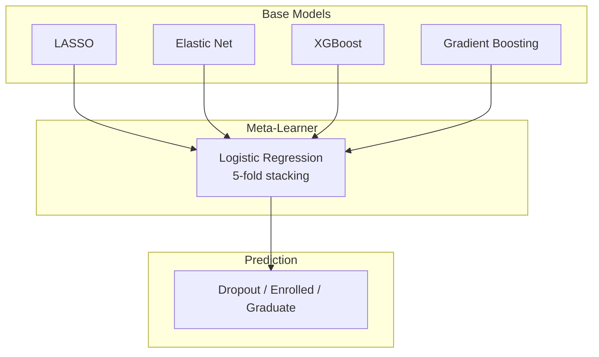

# Student Retention Analysis & Prediction

This project focuses on analyzing student data to predict academic retention, specifically classifying whether a student will ultimately **Graduate**, remain **Enrolled**, or **Dropout**. To achieve robust performance, the system combines data preprocessing, multiple machine-learning models, and a **Stacking Ensemble**.

## The Dataset

The dataset was gathered by the Research Center for Endogenous Resource Valorization, Polytechnic Institute of Portalegre. It consists of multiple features characterizing each student's academic path, socioeconomic background, and macroeconomic indicators at the time of enrollment.

### Key Feature Categories:
- **Demographics & Family Background**: Age at enrollment, gender, nationality, displaced status, marital status, parental qualifications, and occupations.
- **Academic Path**: Application mode, application order, course selected, daytime/evening attendance, and previous qualifications.
- **Academic Performance**: Number of curricular units credited, enrolled, evaluated, approved, and their respective grades for both the 1st and 2nd semesters.
- **Financial Situation**: Tuition fees up to date, debtor status, and scholarship holder.
- **Macroeconomic Factors**: Unemployment rate, inflation rate, and GDP.

## Exploratory Data Analysis (EDA) & Data Preprocessing

Comprehensive Exploratory Data Analysis (EDA) and preprocessing were conducted:
- **Statistical Tests**: ANOVA, Chi-Square contingency, Fisher's Exact test, and Tukey HSD were used to identify the most statistically significant predictors of student success and dropout rates.
- **Multicollinearity Removal**: Features with absolute correlation `|r| > 0.85` were dropped to satisfy statistical model assumptions.
- **Imbalance Fix**: The dataset struggles heavily with predicting "Enrolled" students. To mitigate this, **SMOTE** (Synthetic Minority Over-sampling Technique) was applied exclusively to the training fold to avoid data leakage.

## Machine Learning Architecture & Stacking Ensemble

Instead of relying on a single algorithm, this project uses a **Stacking Ensemble** architecture. This allows four different, complementary base models to produce initial predictions, which are then combined by a final meta-learner for maximum accuracy and robustness.

### Base Models Evaluated:
1. **LASSO**: Generalized Linear Model (GLM) with L1 penalty for feature selection and interpretability.
2. **Elastic Net**: GLM with both L1 and L2 penalties.
3. **XGBoost**: Highly optimized, scalable gradient-boosted decision tree algorithm.
4. **Gradient Boosting**: Scikit-Learn's implementation of gradient boosting to capture non-linear relationships.

### Ensemble Architecture Diagram



### Model Performance

The stacked ensemble approach significantly improves the robustness of the predictions. Below is the performance evaluation of the models on the test set:

| Model | Accuracy | Macro-F1 | ROC-AUC |
|-------|----------|----------|---------|
| LASSO | 74.99% | 70.88 | 88.45 |
| Elastic Net | 74.95% | 70.83 | 88.42 |
| XGBoost | 77.40% | 72.48 | 88.67 |
| Gradient Boosting | 77.03% | 72.37 | 88.84 |
| **Stacked Ensemble** | **77.76%** | **72.10** | **89.04** |

> [!NOTE]
> **Metric Interpretation:** Accuracy measures overall correct predictions. Macro-F1 gives equal importance to all three classes (vital since "Enrolled" is a minority class). ROC-AUC measures how effectively the model separates the three outcome classes. The Stacked Ensemble yields the highest Accuracy and ROC-AUC.

---

## Running the Interactive UI

An interactive Gradio Web UI has been developed for real-time predictions. The UI focuses on the most predictive features, handles input formatting automatically, and explains the models and features in a comprehensive "How It Works" and "Dataset Dictionary" tabs.

### Local Setup
Ensure you have Python 3 installed, then run the following:

```bash
# 1. Activate your virtual environment (if applicable)
source .venv/bin/activate

# 2. Install dependencies
pip install -r requirements.txt

# 3. Launch the application
python3 app.py
```

### Hugging Face Deployment
This repository is configured with **Git LFS** for the `.joblib` model weights and a complete `requirements.txt`. To deploy to Hugging Face Spaces:
1. Create a new **Gradio** Space on Hugging Face.
2. Add the Space as a remote and push the `main` branch. The Hugging Face platform will automatically install dependencies and launch the app.
