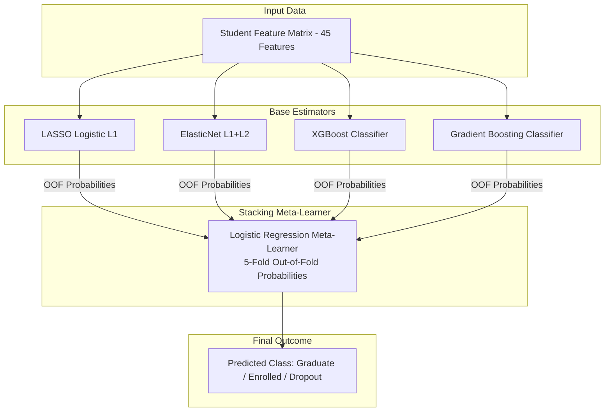

# Student Retention Analysis & Prediction System

[](https://www.python.org/)
[](https://gradio.app/)
[](https://scikit-learn.org/)
[](https://xgboost.readthedocs.io/)
[](https://huggingface.co/spaces)

An end-to-end Machine Learning solution designed to predict higher education student retention outcomes (**Graduate**, **Enrolled**, or **Dropout**). The project combines statistical Exploratory Data Analysis (EDA), domain-specific feature engineering, class imbalance mitigation via SMOTE, hyperparameter tuning, and a 5-Fold Stacking Ensemble deployed via an interactive Gradio web application.

---

## Executive Summary & Objectives

Early detection of students at risk of dropping out allows academic institutions to deliver timely financial, academic, and psychological intervention. This project tackles the retention prediction challenge through a multi-stage data science workflow:
- **Primary Goal**: Classify student academic status into three categories (*Dropout*, *Enrolled*, *Graduate*) with high reliability and calibrated probabilities.
- **Key Challenge**: Resolving class imbalance—particularly for the underrepresented *Enrolled* category—without causing data leakage.
- **Solution**: A **Stacking Ensemble Classifier** leveraging diverse base learners (L1/L2 regularized GLMs, Gradient Boosted Trees, and XGBoost) combined by a Logistic Regression meta-learner.

---

## Dataset & Feature Architecture

The dataset originates from the *Research Center for Endogenous Resource Valorization, Polytechnic Institute of Portalegre*. It captures student demographic backgrounds, socioeconomic indicators, academic history, and macroeconomic context upon enrollment.

### Key Feature Categories:
- **Demographics & Family Background**: Age at enrollment, gender, nationality, displaced status, marital status, educational special needs, parental qualifications, and occupations.
- **Academic Path & History**: Application mode, application order, selected course, daytime/evening attendance, and prior qualification details.
- **Academic Performance (1st & 2nd Semesters)**: Units credited, enrolled, evaluated, approved, and grade averages for both semesters.
- **Financial & Social Support**: Tuition fee payment status, debtor status, and scholarship holder status.
- **Macroeconomic Indicators**: Regional unemployment rate, inflation rate, and GDP growth rate at enrollment.

### Domain Feature Engineering:
To enhance predictive power, key ratio and trend features were constructed:
- `approval_rate_1st` & `approval_rate_2nd`: Ratio of approved units to enrolled units per semester.
- `eval_per_unit_1st` & `eval_per_unit_2nd`: Ratio of evaluations conducted per enrolled unit.
- `approval_rate_total` & `approved_total`: Cumulative units approved across both semesters.
- `zero_approved_any`: Binary flag indicating zero approved units in either semester.
- `approval_trend` & `grade_trend`: Semester-over-semester differences in approval rates and average grades.
- `grade_mean`: Combined mean grade across 1st and 2nd semester evaluations.
- `financial_risk`: Interaction score combining debtor status and tuition fee updates.

---

## Exploratory Data Analysis & Preprocessing

1. **Statistical Hypothesis Testing**: Applied ANOVA, Chi-Square contingency tests, Fisher's Exact test, and Tukey HSD to isolate the most statistically significant feature subsets.
2. **Multicollinearity Removal**: Filtered highly collinear features (`|r| > 0.85`) to maintain linear model stability.
3. **Imbalance Mitigation via SMOTE**: Applied Synthetic Minority Over-sampling Technique (SMOTE) strictly inside cross-validation training folds to ensure zero data leakage into evaluation sets.

---

## Machine Learning Architecture & Stacking Ensemble

The system utilizes a **5-Fold Cross-Validated Stacking Ensemble** architecture. Four complementary base estimators generate out-of-fold probability predictions, which are passed into a Logistic Regression meta-learner.

### Architecture Diagram:


```mermaid
graph TD
    subgraph Input Data
        X[Student Feature Matrix - 45 Features]
    end

    subgraph Base Estimators
        A[LASSO Logistic L1]
        B[ElasticNet L1+L2]
        C[XGBoost Classifier]
        D[Gradient Boosting Classifier]
    end

    subgraph Stacking Meta-Learner
        E[Logistic Regression Meta-Learner<br/>5-Fold Out-of-Fold Probabilities]
    end

    subgraph Final Outcome
        F[Predicted Class: Graduate / Enrolled / Dropout]
    end

    X --> A
    X --> B
    X --> C
    X --> D

    A -->|OOF Probabilities| E
    B -->|OOF Probabilities| E
    C -->|OOF Probabilities| E
    D -->|OOF Probabilities| E

    E --> F
```

---

## Model Performance & Evaluation

The **Stacked Ensemble** achieved top-tier performance on held-out test data, outperforming individual base models and all statistical baselines across **Accuracy**, **Macro-F1**, and **ROC-AUC**.

### Primary Model Benchmark Table:

| Model | Accuracy | Macro-F1 | ROC-AUC | Description / Strategy |
| :--- | :---: | :---: | :---: | :--- |
| **FINAL STACKED ENSEMBLE** | **77.76%** | **72.10%** | **89.04%** | **Meta-Learner combining all 4 base models** |
| **Final XGBoost (Tuned)** | 77.40% | 72.48% | 88.67% | Gradient Boosted Decision Trees |
| **Final Gradient Boosting (Tuned)** | 77.03% | 72.37% | 88.84% | Scikit-Learn Gradient Boosting |
| **Final LASSO (Tuned)** | 74.99% | 70.88% | 88.45% | Logistic Regression with L1 Penalty |
| **Final Elastic Net (Tuned)** | 74.95% | 70.83% | 88.42% | Logistic Regression with L1 + L2 Penalty |

---

### Comprehensive Alternative Models Comparison

Below is the evaluation chart comparing all 15 baseline, statistical, regularized, and ensemble model variants tested during research:

<p align="center">
  
</p>

---

### Stacked Ensemble Confusion Matrix

The confusion matrix demonstrates strong class separation, particularly distinguishing between *Dropout* and *Graduate* outcomes while accurately identifying *Enrolled* students:

<p align="center">
  
</p>

---

## Web Application & Interactive UI

The Gradio web application ([app.py](file:///home/chandima-bandara/Desktop/student-retention-analysis/app.py)) provides a modern, responsive user dashboard:

- **Model Selector**: Dynamically switches active model pipelines (**Stacked Ensemble**, **XGBoost**, **Gradient Boosting**, **ElasticNet**, **LASSO**).
- **Dynamic Feature Masking**: Automatically shows/hides input fields based on the selected model's exact required features.
- **Random Case Generator**: Populates realistic sample inputs for fast testing.
- **"How It Works" Tab**: Interactive HTML dashboard with embedded charts explaining the stacking architecture, metrics, and confusion matrix.
- **"Dataset Dictionary" Tab**: Full documentation of all 45 dataset features and their categorical mappings.

---

## Local Installation & Usage Guide

### Prerequisites
- Python `3.10` or `3.11`
- Git LFS (for downloading `.joblib` model binaries)

### 1. Clone the Repository
```bash
git clone https://github.com/chandimacbbandara/student-retention-analysis.git
cd student-retention-analysis
```

### 2. Set Up Virtual Environment & Install Dependencies
```bash
# Create virtual environment
python3 -m venv .venv
source .venv/bin/activate

# Install requirements
pip install -r requirements.txt
```

### 3. Launch the Web Application
```bash
python3 app.py
```
Open your browser and navigate to `http://localhost:7860`.

---

## Hugging Face Spaces Deployment

This repository is pre-configured for deployment to **Hugging Face Spaces** using the `gradio` SDK:

```bash
# Push directly to your Hugging Face Space remote
git push huggingface main
```

---

## License & Attribution

- **Dataset Credit**: Research Center for Endogenous Resource Valorization, Polytechnic Institute of Portalegre.
- **Project Developer**: Chandima Bandara
